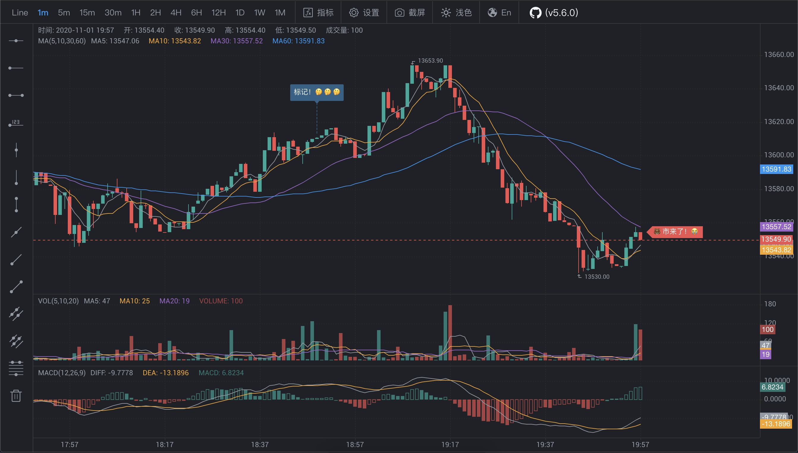

# KLineChart
[](https://www.npmjs.com/package/klinecharts)
[](https://travis-ci.org/liihuu/KLineChart)
[](https://www.codacy.com/manual/liihuu/KLineChart?utm_source=github.com&amp;utm_medium=referral&amp;utm_content=liihuu/KLineChart&amp;utm_campaign=Badge_Grade)
[](https://bundlephobia.com/result?p=klinecharts@latest)
[](types/index.d.ts)
[](LICENSE)

📈Lightweight k-line chart that can be highly customized, built with html5 canvas. Support custom technical indicators and parameter settings. Support line drawing.

## Installing
### Using npm
```bash
npm install klinecharts --save
```
### CDN
You can use [unpkg](https://unpkg.com):<br/>
https://unpkg.com/klinecharts/dist/klinecharts.production.min.js

## Docs
+ [中文](./docs/zh-CN/README.md)
+ [English](./docs/en/README.md)

## Build
Execute command in root directory. [Node.js](https://nodejs.org) is required.
```bash
# Install the dependencies from NPM:
npm install

# Build files:
npm run build
```
The generated files are in the dist folder.


## Resources
### Technical Indicators
[https://github.com/liihuu/TechnicalIndicator](https://github.com/liihuu/TechnicalIndicator)

### Sample Code
[https://github.com/liihuu/KLineChartSample](https://github.com/liihuu/KLineChartSample)

## Screenshot


## License
KLineChart is available under the Apache License V2.

## Reward Author
+ BTC: [bc1qnwzukszzk5xfk0zs3sr8etzgctgnrtqts43jzp3khe6gm7xazprsp4y6n3]()
+ ETH: [0xd2c3911654db861e0a2e17415e11a209c1fc3594]()
+ BCH: [36MPYddUxU2vGDB1zakjisoRHMGqZiVnz9]()
+ USDT-ERC20: [0xd2c3911654db861e0a2e17415e11a209c1fc3594]()
+ USDT-Omni: [3DSXSbTbMwXumaaqMySVPgedBP9rGhpnfQ]()
+ USDT-TRC20: [THJpTQmFGaVm12KE1Jzc5mLXiApP6qXMCi]()
