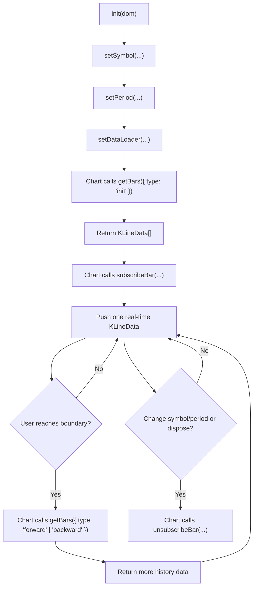

<script setup>
import SetDataLoaderSample from '../@views/api/samples/setDataLoader/index.vue'
</script>

# Data Integration

This guide shows how to integrate historical candles and real-time updates into the chart. The core task is implementing a data loader via `setDataLoader`.

If you only want the fastest path to integration, remember this:

- You only need to implement 3 functions: `getBars`, `subscribeBar`, and `unsubscribeBar`

They are responsible for:

- `getBars`: return historical candles for both initial load and pagination
- `subscribeBar`: start pushing the latest candle after historical data is ready
- `unsubscribeBar`: stop the real-time stream when symbol/period changes or the chart is disposed

## Integration Flow

You can understand the whole integration as 4 stages:



### Stage 1: Initialize the Chart

What you do:

- Call `init(dom)` to create the chart instance
- Call `setSymbol(...)` to set the symbol
- Call `setPeriod(...)` to set the period
- Call `setDataLoader(...)` to register the loader

Result of this stage:

- the chart is ready to request data

### Stage 2: Load the First Screen of History

Who triggers it:

- the chart automatically

What happens:

- the chart calls `getBars({ type: 'init' })`
- you request historical data
- you return it through `callback(KLineData[])`

Result of this stage:

- the chart gets the first batch of candles and completes the initial render

### Stage 3: Receive Real-Time Updates

Who triggers it:

- the chart automatically after the first historical load is completed

What happens:

- the chart calls `subscribeBar(...)`
- you create a WebSocket / SSE / polling subscription
- whenever a new latest candle arrives, you call `callback(KLineData)`

Result of this stage:

- the chart keeps updating the last candle or appending a new candle

### Stage 4: Continue Pagination or Stop Subscription

During pagination:

- when the user reaches the left or right boundary, the chart calls `getBars({ type: 'forward' | 'backward' })`
- you return more historical data and use `more` to tell the chart whether more pages still exist

When stopping:

- when `symbol` changes, `period` changes, `resetData` is called, or the chart is disposed
- the chart calls `unsubscribeBar(...)`
- you stop the corresponding real-time subscription

Result of this stage:

- the chart can keep loading more history or safely stop the data stream

## Minimum Working Version

If your goal is to get it working first, these are the only 3 requirements:

1. `getBars` must call `callback(KLineData[])`
2. `subscribeBar` must call `callback(KLineData)` when a new candle arrives
3. `unsubscribeBar` must really stop your WebSocket / SSE / polling

Once these 3 points are correct, the chart can complete the basic loop of historical data plus real-time updates.

## Common Integration Scenarios

In real projects, you will usually see one of these patterns:

- REST history + WebSocket real-time
  - the most common setup
  - `getBars` requests historical data from REST
  - `subscribeBar` listens to WebSocket updates
- REST history + polling real-time
  - useful when no WebSocket is available
  - `subscribeBar` internally uses `setInterval` to fetch the latest candle
- Local cache/in-memory history + incremental push
  - useful for replay, simulation, or offline demos
  - `getBars` reads slices from local data
  - `subscribeBar` pushes the next candle over time

No matter where your data comes from, the final integration model is always the same:

- historical data returns `KLineData[]`
- real-time data returns one `KLineData`

## KLineData Structure

The chart expects candle data in a fixed format. Both historical and real-time data returned through `setDataLoader` should be normalized to this shape:

```ts
{
  // Timestamp, millisecond, required field
  timestamp: number
  // Open price, required field
  open: number
  // Close price, required field
  close: number
  // Highest price, required field
  high: number
  // Lowest price, required field
  low: number
  // Volume, optional field
  volume: number
  // Turnover, optional field. Required if you want to display 'EMV' and 'AVP'
  turnover: number
}
```

Important notes:

- `timestamp` must be in milliseconds
- Historical arrays should be returned in ascending `timestamp` order
- Real-time pushes must use the same `KLineData` shape

## Field Mapping Example

Backend payloads usually do not match `KLineData` directly, so you will normally normalize them first.

For example, if your backend returns:

```ts
{
  time: 1711425600,
  o: '68000.1',
  h: '68920.5',
  l: '67500.2',
  c: '68610.8',
  v: '1234.56'
}
```

You can normalize it like this:

```ts
function normalizeToKLineData(data: any) {
  return {
    timestamp: data.time * 1000,
    open: Number(data.o),
    high: Number(data.h),
    low: Number(data.l),
    close: Number(data.c),
    volume: Number(data.v),
  }
}
```

If your API returns a list, it is also recommended to normalize everything through `map(normalizeToKLineData)` before calling `callback(...)`.

## Required APIs

1. `init(dom)`
2. `setSymbol(...)`
3. `setPeriod(...)`
4. `setDataLoader({ getBars, subscribeBar, unsubscribeBar })`

Notes:

- The chart triggers `getBars` only after the symbol and period are set and the visible area requires data.
- Your `getBars` must return `KLineData[]` by calling `callback(...)`.

<SetDataLoaderSample/>

## getBars: Historical Candles with Pagination

`getBars` fetches candles whenever the chart needs historical data.

The parameter contract is:

```ts
getBars: ({
  type,
  timestamp,
  symbol,
  period,
  callback
}: DataLoaderGetBarsParams) => void | Promise<void>
```

You can read it as:

- the chart tells you which range it needs
- you request the backend or cache
- you send the result back through `callback(...)`

Key fields:

- `type`
  - `init`: initial load. `timestamp = null` at this time.
  - `forward`: load earlier candles on the left boundary.
  - `backward`: load later candles on the right boundary.
- `timestamp`
  - `init`: `null`
  - other values: reference timestamp near the current boundary
- `callback(data, more)`
  - `data`: `KLineData[]`
  - `more`: whether there is more data on each side
    - you can pass `boolean` (same for both sides)
    - or `{ forward?: boolean, backward?: boolean }` to control each side

Most common implementation:

- `init`: fetch a recent chunk of history
- `forward`: fetch older candles using the left boundary `timestamp`
- `backward`: fetch newer candles using the right boundary `timestamp`

If your API only supports backward-looking pagination, it is fine to first implement only `init` and `forward`.

### How to Return `more`

`more` does not mean “how much data was returned this time”. It means “is there still more data in this direction”.

For example:

- if older data still exists, return `callback(bars, { forward: true })`
- if you already reached the earliest page, return `callback(bars, { forward: false })`
- if you do not need separate control for both directions, you can also return `callback(bars, false)`

A practical rule is:

- if the backend returns fewer items than your page size, that direction usually has no more data
- if the backend gives you `hasMore` or `nextCursor`, prefer that backend result

### getBars Implementation Tips

- Do not return unsorted data
- Try to avoid duplicate timestamps
- If the API fails, do not silently swallow the error and also skip callback handling
- If requests can race, only keep the latest result for the current symbol/period

## Data merge rules (historical pagination + real-time)

Understanding “data merge” helps you implement correct pagination and real-time pushing.

### Historical merge (`getBars` returning `KLineData[]`)

- `type: 'init'`：clear existing data and replace it with the new array.
- `type: 'forward'`：prepend the new data (left side / earlier candles).
- `type: 'backward'`：append the new data (right side / later candles).
- `more` only controls whether pagination is allowed to continue on the left/right side.

### Real-time merge (`subscribeBar` callback returning a single `KLineData`)

When the chart receives one real-time candle, it merges by comparing `data.timestamp` to the current last candle:

- `data.timestamp` is greater：append as a new last candle
- `data.timestamp` is equal：overwrite the last candle
- `data.timestamp` is smaller：ignore it (no insertion)

## subscribeBar: Real-Time Single-Candle Updates

The chart calls `subscribeBar` only after the `init` `getBars` callback is completed (i.e., after historical data is ready).

Signature:

```ts
subscribeBar: ({
  symbol,
  period,
  callback
}: DataLoaderSubscribeBarParams) => void
```

Where:

- `callback(data: KLineData)`: when your real-time source receives one candle, normalize it to `KLineData` and call `callback`.

Real-time tips:

- Push one latest candle at a time. You do not need to resend the full array
- Use millisecond timestamps for `data.timestamp`
- If `data.timestamp` equals the last candle's timestamp, the chart updates/overwrites that candle
- Avoid sending “older” timestamps as new appended candles

### Real-Time Update Notes

- Push the candle for the current period bucket, not arbitrary trade ticks
- The latest candle in the same period will often be updated multiple times, which is expected
- Only when time enters the next period should you push a candle with a new `timestamp`

For example, on a 1-minute period:

- updates from `10:00:00` to `10:00:59` should all belong to the candle at `10:00:00`
- only after `10:01:00` should you push a new candle at `10:01:00`

## unsubscribeBar: Stop Real-Time Subscription

When you call `setSymbol` / `setPeriod` / `resetData` / destroy the chart (`dispose`), the chart will trigger `unsubscribeBar`.

Best practice:

- Keep a Map of “stop handlers” keyed by `symbol`/`period`
- Create the subscription in `subscribeBar` and store its stop function
- Stop it in `unsubscribeBar`

## Data Integration Template (Historical + Real-Time)

Replace `fetchBars`, `subscribeRealTime`, and `unsubscribeRealTime` with your own implementations.

```ts
import { init, dispose } from 'klinecharts'

const chart = init('chart')

chart.setSymbol({ ticker: 'TestSymbol' /* optionally pricePrecision/volumePrecision */ })
chart.setPeriod({ span: 1, type: 'day' })

const stopMap = new Map<string, () => void>()

function makeKey(symbol: any, period: any) {
  return `${symbol?.ticker ?? ''}-${period?.type ?? ''}-${period?.span ?? ''}`
}

chart.setDataLoader({
  async getBars({ type, timestamp, symbol, period, callback }) {
    const { bars, forward, backward } = await fetchBars({
      type,
      timestamp,
      symbol,
      period,
    })

    // Strongly recommended: return bars sorted by timestamp asc
    callback(bars, { forward: !!forward, backward: !!backward })
  },

  subscribeBar({ symbol, period, callback }) {
    const key = makeKey(symbol, period)

    const stop = subscribeRealTime({
      symbol,
      period,
      onBar: (rawBar: any) => {
        const klineBar = normalizeToKLineData(rawBar)
        callback(klineBar)
      },
    })

    stopMap.set(key, stop)
  },

  unsubscribeBar({ symbol, period }) {
    const key = makeKey(symbol, period)
    const stop = stopMap.get(key)
    if (stop) stop()
    stopMap.delete(key)
  },
})

dispose('chart')
```

## Real Project Checklist

For production integration, it is worth checking these items:

1. How `symbol` maps to your backend symbol field
2. How `period` maps to your backend interval parameter
3. Whether timestamps are in seconds or milliseconds
4. Whether price and volume fields need `Number(...)`
5. Whether the history API guarantees ascending order
6. Whether pagination can return duplicate candles
7. Whether old subscriptions are cleaned up after symbol/period changes
8. Whether polling or WebSocket connections stop after chart disposal

## A More Realistic Pseudo Example

This shows a typical REST-history + WebSocket-real-time approach:

```ts
chart.setDataLoader({
  async getBars({ type, timestamp, symbol, period, callback }) {
    const response = await api.getKlineList({
      symbol: symbol.ticker,
      period: `${period.span}${period.type}`,
      endTime: timestamp ?? Date.now(),
      limit: 500,
      direction: type,
    })

    const bars = response.list
      .map(normalizeToKLineData)
      .sort((a, b) => a.timestamp - b.timestamp)

    callback(bars, {
      forward: response.hasMoreBefore,
      backward: response.hasMoreAfter,
    })
  },

  subscribeBar({ symbol, period, callback }) {
    const key = makeKey(symbol, period)
    const ws = createWsConnection(symbol.ticker, period)

    ws.onmessage = (message) => {
      const bar = normalizeToKLineData(JSON.parse(message.data))
      callback(bar)
    }

    stopMap.set(key, () => ws.close())
  },

  unsubscribeBar({ symbol, period }) {
    const key = makeKey(symbol, period)
    stopMap.get(key)?.()
    stopMap.delete(key)
  },
})
```

## What You Should Handle Yourself

- Convert your backend payload into `KLineData`
- Request the correct data using `symbol + period + timestamp`
- Keep and clean up your real-time subscription handles

## What the Chart Handles for You

- Rendering the first screen of history
- Merging paginated historical data
- Overwriting or appending the latest real-time candle
- Triggering unsubscribe when symbol/period changes or the chart is disposed

## Common Edge Cases

- No data on first load
  - usually `getBars` did not call `callback(...)`
- Real-time messages arrive but the chart does not update
  - usually the pushed `timestamp` does not match the current period bucket
- Old data still flashes after symbol change
  - usually the previous real-time subscription was not cleaned up
- Duplicate candles appear after loading older history
  - usually boundary timestamp handling is inconsistent, or backend data already contains duplicate timestamps
- Indicator values look wrong
  - first check whether `volume` and `turnover` are passed correctly

## Quick Troubleshooting

1. No data at all
   - Ensure `getBars` always calls `callback(data)` with `KLineData[]`
   - Ensure `timestamp` is in milliseconds
   - Ensure you call `setSymbol` and `setPeriod`
2. Pagination does not trigger
   - Check `callback(bars, more)` and `more.forward/backward`
3. Real-time updates do not work
   - Ensure `subscribeBar` calls `callback(KLineData)`
   - Ensure the real-time stream timestamp matches the candle time bucket
